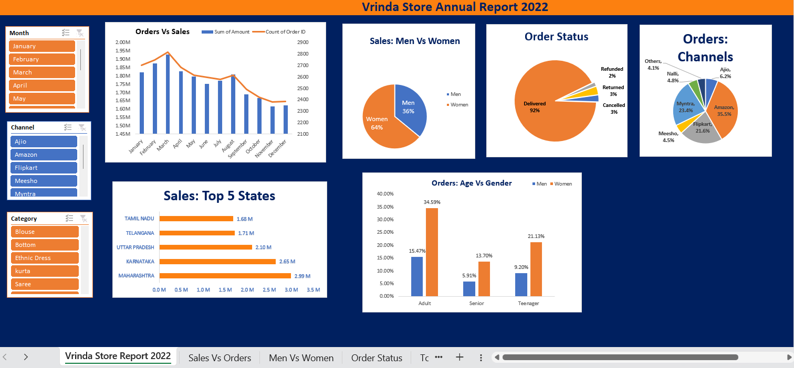

# Vrinda-Store-Data-Analysis
Excel-based sales analysis and interactive dashboard for Vrinda Store 2022 data.
# 🛍️ Vrinda Store Sales Analysis & Dashboard

> An Excel-based sales analysis project exploring customer behavior, sales performance, order trends, and sales channels using Vrinda Store's 2022 data.

## 📊 Project Overview

This project analyzes **31,000+ sales records** from Vrinda Store to identify important business trends and customer patterns.

An interactive dashboard was created using **Microsoft Excel**, using Pivot Tables, Pivot Charts, and Slicers to make the analysis easy to explore and understand.

The goal of this project is to transform raw sales data into meaningful **business insights and actionable recommendations**.

---

## 🎯 Objectives

* Analyze monthly sales and order trends
* Compare purchasing behavior between men and women
* Identify the top-performing states
* Analyze order status and delivery performance
* Understand customer distribution by age and gender
* Identify the most popular sales channels
* Extract actionable business insights from the data

---

## 🛠️ Tools & Skills Used

* **Microsoft Excel**
* Data Cleaning
* Data Transformation
* Pivot Tables
* Pivot Charts
* Slicers
* Data Visualization
* Exploratory Data Analysis
* Business Analysis
* Data Storytelling

---

## 📈 Dashboard

The dashboard provides an overview of:

* **Sales vs Orders** by month
* **Sales by Gender**
* **Order Status**
* **Top 5 States** by sales
* **Age Group vs Gender**
* **Sales Channel** performance



---

## 🔑 Key Performance Metrics

| Metric                 |      Result |
| ---------------------- | ----------: |
| 💰 Total Sales         |     ₹21.18M |
| 📦 Total Orders        |      28,471 |
| 🛒 Total Quantity      |      31,237 |
| 👩 Women Sales         |     ₹13.56M |
| 👨 Men Sales           |      ₹7.61M |
| 🥇 Top State           | Maharashtra |
| 🛒 Top Channel         |      Amazon |
| 📅 Highest Sales Month |       March |
| 🚚 Delivered Orders    |      92.25% |
| ↩️ Returned Orders     |       3.37% |
| ❌ Cancelled Orders     |       2.72% |

---

## 💡 Key Insights

### 👩 Gender Analysis

Women customers contributed approximately **64% of total sales**, while men contributed approximately **36%**.

This indicates that women customers were the primary contributors to Vrinda Store's overall revenue.

### 📅 Monthly Sales Performance

**March** recorded the highest sales at approximately **₹1.93M**.

The analysis also shows a decline in sales during several months after the peak period.

### 📍 Top Performing States

The top 5 states by sales were:

1. **Maharashtra** — ₹2.99M
2. **Karnataka** — ₹2.65M
3. **Uttar Pradesh** — ₹2.10M
4. **Telangana** — ₹1.71M
5. **Tamil Nadu** — ₹1.68M

These states represent a significant portion of the store's overall sales.

### 🛒 Sales Channels

**Amazon** was the leading sales channel, accounting for approximately **35.48% of orders**.

Other major channels included:

* Myntra — 23.4%
* Flipkart — 21.6%
* Ajio — 6.2%
* Nalli — 4.8%
* Meesho — 4.5%
* Others — 4.1%

### 🚚 Order Status

Approximately **92.25% of orders were successfully delivered**.

Returned orders accounted for approximately **3.37%**, while cancelled orders represented approximately **2.72%**.

---

## 📌 Business Recommendations

Based on the analysis, the following actions could help improve sales performance:

* Focus marketing campaigns on high-performing states such as **Maharashtra and Karnataka**.
* Develop targeted campaigns for **women customers**, who contribute the majority of sales.
* Investigate the reasons behind the decline in sales after the peak month.
* Strengthen high-performing channels such as **Amazon and Myntra**.
* Analyze returned and cancelled orders to identify potential operational or product-related issues.
* Use age and gender insights to create more personalized marketing campaigns.

---

## 📂 Dataset

The dataset contains information related to:

* Order ID
* Customer ID
* Gender
* Age
* Age Group
* Order Date
* Order Status
* Channel
* Product Category
* Size
* Quantity
* Sales Amount
* Shipping Location
* B2B Orders

> **Note:** Customer-level/order-level information should be handled carefully when publishing the project publicly. The repository should avoid exposing unnecessary personal or sensitive information.

---

## 📁 Project Structure

```text
Vrinda-Store-Sales-Analysis/
│
├── README.md
├── Vrinda_Store_Dashboard.xlsx
└── dashboard_preview.png
```

---

## 🚀 What I Learned

Through this project, I practiced:

* Cleaning and preparing raw sales data
* Creating calculated fields
* Building Pivot Tables
* Creating interactive dashboards
* Using charts to communicate data
* Identifying trends and patterns
* Converting data into business insights
* Presenting analytical findings in a clear and understandable way

---

## 👤 Author

Parth Sarthi Sharma

Aspiring Data Analyst

**Skills:** Excel • SQL • Python • Power BI • Data Analysis

---

⭐ If you found this project useful, feel free to explore the dashboard and analysis.
